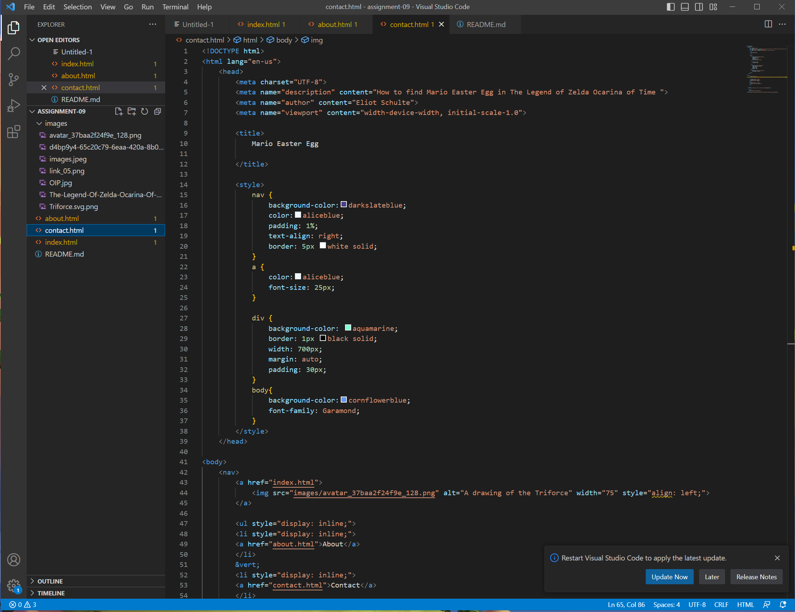

I had a lot of fun learning HTML. Learning how to use the input commands for contact pages was a bit confusing to me. I loved being able to stylize the fonts and colors of each page. Being able to personalize a web page with pictures and videos is very rewarding, and something I may pursue further on into my multi-media career! I
I honestly dont know a ton about CSS. I have used it before but if there is any game development aspect to it then I am very eager to get into that! 
